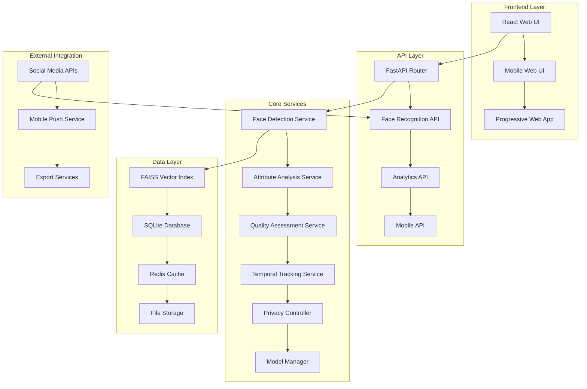

# Advanced Face Recognition Features - Design Document

## Overview

This design document specifies the technical architecture for implementing 19 advanced face recognition features that will elevate PhotoSearch from 85-90% complete to a production-ready, industry-leading face recognition system. The design builds upon the existing InsightFace buffalo_l architecture while adding high-performance vector search, advanced analytics, mobile support, and enterprise features.

The system will maintain its privacy-first, local-processing advantage while achieving performance and feature parity with cloud-based competitors like Google Photos and Apple Photos.

## Architecture

### High-Level Architecture



### Component Architecture

The design extends the existing modular architecture with new specialized components:

1. **Enhanced Core Services**: Extend existing face detection with attribute analysis and quality assessment
2. **High-Performance Search**: Replace linear search with FAISS-based vector similarity search
3. **Analytics Engine**: New service for generating insights and recommendations
4. **Mobile Services**: Optimized APIs and offline capabilities for mobile devices
5. **Privacy Framework**: Enhanced privacy controls and consent management
6. **Integration Layer**: APIs for external system connectivity

## Components and Interfaces

### 1. Enhanced Face Detection Pipeline

**Extends**: `src/face_clustering.py`, `server/face_detection_service.py`

```python
@dataclass
class EnhancedFaceDetection:
    """Extended face detection with all attributes"""
    # Existing fields
    id: str
    photo_path: str
    bbox_x: int
    bbox_y: int
    bbox_width: int
    bbox_height: int
    confidence: float
    embedding: List[float]
    quality_score: float

    # New attribute fields
    age_estimate: Optional[int] = None
    age_confidence: Optional[float] = None
    emotion: Optional[str] = None  # happy, sad, angry, surprised, fearful, disgusted, neutral
    emotion_confidence: Optional[float] = None
    pose_type: Optional[str] = None  # frontal, profile, three_quarter
    pose_confidence: Optional[float] = None
    gender: Optional[str] = None  # male, female
    gender_confidence: Optional[float] = None

    # Enhanced quality metrics
    blur_score: Optional[float] = None
    lighting_score: Optional[float] = None
    occlusion_score: Optional[float] = None
    resolution_score: Optional[float] = None
    overall_quality: Optional[float] = None

class FaceAttributeAnalyzer:
    """Analyzes facial attributes using specialized models"""

    def __init__(self, models_dir: Path):
        self.age_model = None
        self.emotion_model = None
        self.pose_model = None
        self.gender_model = None

    def analyze_attributes(self, face_crop: np.ndarray, landmarks: np.ndarray) -> Dict:
        """Analyze all facial attributes for a face crop"""
        return {
            'age_estimate': self._estimate_age(face_crop),
            'emotion': self._detect_emotion(face_crop),
            'pose_type': self._classify_pose(landmarks),
            'gender': self._classify_gender(face_crop)
        }

    def _estimate_age(self, face_crop: np.ndarray) -> Tuple[int, float]:
        """Estimate age with confidence score"""
        # Implementation using age estimation model
        pass

    def _detect_emotion(self, face_crop: np.ndarray) -> Tuple[str, float]:
        """Detect emotion with confidence score"""
        # Implementation using emotion detection model
        pass

class AdvancedFaceQualityAssessor:
    """Enhanced face quality assessment"""

    def assess_comprehensive_quality(self, face_crop: np.ndarray, landmarks: np.ndarray) -> Dict:
        """Comprehensive quality assessment"""
        blur_score = self._assess_blur(face_crop)
        lighting_score = self._assess_lighting(face_crop)
        occlusion_score = self._detect_occlusion(face_crop, landmarks)
        pose_score = self._assess_pose_quality(landmarks)
        resolution_score = self._assess_resolution(face_crop)

        # Weighted overall score
        overall_score = (
            blur_score * 0.3 +
            lighting_score * 0.25 +
            occlusion_score * 0.2 +
            pose_score * 0.15 +
            resolution_score * 0.1
        )

        return {
            'blur_score': blur_score,
            'lighting_score': lighting_score,
            'occlusion_score': occlusion_score,
            'pose_score': pose_score,
            'resolution_score': resolution_score,
            'overall_quality': overall_score
        }
```

### 2. High-Performance Vector Search

**Replaces**: `server/face_embedding_index.py`

```python
import faiss
import numpy as np
from typing import List, Tuple, Optional

class FAISSEmbeddingIndex:
    """High-performance FAISS-based similarity search"""

    def __init__(self, dimension: int = 512, index_type: str = "IndexFlatIP"):
        self.dimension = dimension
        self.index_type = index_type
        self.index = None
        self.id_map = {}  # Maps FAISS indices to face IDs
        self.reverse_map = {}  # Maps face IDs to FAISS indices

    def build_index(self, embeddings: List[Tuple[str, np.ndarray]]) -> None:
        """Build FAISS index from embeddings"""
        if self.index_type == "IndexFlatIP":
            self.index = faiss.IndexFlatIP(self.dimension)
        elif self.index_type == "IndexIVFFlat":
            quantizer = faiss.IndexFlatIP(self.dimension)
            self.index = faiss.IndexIVFFlat(quantizer, self.dimension, 100)

        # Prepare embeddings matrix
        embedding_matrix = np.array([emb for _, emb in embeddings], dtype=np.float32)

        # Normalize for cosine similarity
        faiss.normalize_L2(embedding_matrix)

        # Train index if needed
        if hasattr(self.index, 'train'):
            self.index.train(embedding_matrix)

        # Add embeddings
        self.index.add(embedding_matrix)

        # Build ID mappings
        for i, (face_id, _) in enumerate(embeddings):
            self.id_map[i] = face_id
            self.reverse_map[face_id] = i

    def search(self, query_embedding: np.ndarray, k: int = 10, threshold: float = 0.5) -> List[Tuple[str, float]]:
        """Search for similar faces"""
        if self.index is None:
            return []

        # Normalize query
        query = query_embedding.reshape(1, -1).astype(np.float32)
        faiss.normalize_L2(query)

        # Search
        scores, indices = self.index.search(query, k)

        # Filter by threshold and return results
        results = []
        for score, idx in zip(scores[0], indices[0]):
            if idx != -1 and score >= threshold:
                face_id = self.id_map.get(idx)
                if face_id:
                    results.append((face_id, float(score)))

        return results

    def add_embedding(self, face_id: str, embedding: np.ndarray) -> None:
        """Add single embedding incrementally"""
        if self.index is None:
            return

        # Normalize embedding
        emb = embedding.reshape(1, -1).astype(np.float32)
        faiss.normalize_L2(emb)

        # Add to index
        new_idx = self.index.ntotal
        self.index.add(emb)

        # Update mappings
        self.id_map[new_idx] = face_id
        self.reverse_map[face_id] = new_idx

class PerformanceOptimizedFaceService:
    """Face service with FAISS integration"""

    def __init__(self, db_path: str):
        self.db = FaceClusteringDB(db_path)
        self.faiss_index = FAISSEmbeddingIndex()
        self.cache = {}

    def initialize_index(self) -> None:
        """Initialize FAISS index from existing embeddings"""
        embeddings = self.db.get_all_embeddings()
        self.faiss_index.build_index(embeddings)

    def find_similar_faces(self, face_id: str, threshold: float = 0.7, limit: int = 10) -> List[Dict]:
        """Find similar faces using FAISS"""
        embedding = self.db.get_face_embedding(face_id)
        if embedding is None:
            return []

        similar_faces = self.faiss_index.search(embedding, k=limit, threshold=threshold)

        # Enrich with metadata
        results = []
        for similar_id, score in similar_faces:
            if similar_id != face_id:  # Exclude self
                face_data = self.db.get_face_detection(similar_id)
                if face_data:
                    results.append({
                        'face_id': similar_id,
                        'similarity_score': score,
                        'photo_path': face_data.photo_path,
                        'quality_score': face_data.quality_score
                    })

        return results
```

### 3. Analytics and Insights Engine

**New Component**: `server/face_analytics_service.py`

```python
class FaceAnalyticsEngine:
    """Advanced analytics and insights generation"""

    def __init__(self, db: FaceClusteringDB):
        self.db = db
        self.cache = {}

    def generate_person_timeline(self, person_id: str) -> Dict:
        """Generate aging timeline for a person"""
        photos = self.db.get_photos_for_cluster(person_id)

        # Sort by date and analyze age progression
        timeline_data = []
        for photo in sorted(photos, key=lambda x: x.get('date_taken', '')):
            face_data = self.db.get_faces_for_photo(photo['path'])
            person_faces = [f for f in face_data if f.cluster_id == person_id]

            if person_faces:
                best_face = max(person_faces, key=lambda x: x.quality_score)
                timeline_data.append({
                    'date': photo.get('date_taken'),
                    'photo_path': photo['path'],
                    'face_id': best_face.id,
                    'age_estimate': best_face.age_estimate,
                    'quality_score': best_face.quality_score
                })

        return {
            'person_id': person_id,
            'timeline': timeline_data,
            'age_progression': self._calculate_age_progression(timeline_data),
            'quality_trends': self._analyze_quality_trends(timeline_data)
        }

    def detect_photo_relationships(self) -> Dict:
        """Analyze who appears together most frequently"""
        co_occurrence_matrix = {}

        # Analyze all photos with multiple people
        photos_with_faces = self.db.get_photos_with_multiple_faces()

        for photo in photos_with_faces:
            people_in_photo = self.db.get_people_in_photo(photo['path'])

            # Update co-occurrence matrix
            for i, person1 in enumerate(people_in_photo):
                for person2 in people_in_photo[i+1:]:
                    pair = tuple(sorted([person1.cluster_id, person2.cluster_id]))
                    co_occurrence_matrix[pair] = co_occurrence_matrix.get(pair, 0) + 1

        # Find strongest relationships
        relationships = sorted(
            co_occurrence_matrix.items(),
            key=lambda x: x[1],
            reverse=True
        )[:20]

        return {
            'relationships': relationships,
            'network_graph': self._build_relationship_graph(co_occurrence_matrix),
            'frequent_groups': self._detect_frequent_groups(photos_with_faces)
        }

    def detect_events(self, min_people: int = 3, time_window_hours: int = 24) -> List[Dict]:
        """Detect gatherings and events based on face co-occurrence"""
        events = []

        # Group photos by time windows
        photos_by_time = self._group_photos_by_time(time_window_hours)

        for time_window, photos in photos_by_time.items():
            # Find photos with multiple people
            group_photos = [p for p in photos if len(self.db.get_people_in_photo(p['path'])) >= min_people]

            if len(group_photos) >= 2:  # Multiple photos suggest an event
                people_involved = set()
                for photo in group_photos:
                    people = self.db.get_people_in_photo(photo['path'])
                    people_involved.update(p.cluster_id for p in people)

                events.append({
                    'start_time': min(p.get('date_taken', '') for p in group_photos),
                    'end_time': max(p.get('date_taken', '') for p in group_photos),
                    'photo_count': len(group_photos),
                    'people_count': len(people_involved),
                    'people_involved': list(people_involved),
                    'photos': [p['path'] for p in group_photos],
                    'event_type': self._classify_event_type(group_photos, people_involved)
                })

        return sorted(events, key=lambda x: x['start_time'], reverse=True)

class SmartOrganizationService:
    """Automatic album creation and recommendations"""

    def __init__(self, analytics_engine: FaceAnalyticsEngine):
        self.analytics = analytics_engine
        self.db = analytics_engine.db

    def create_smart_albums(self) -> List[Dict]:
        """Create albums based on face analysis"""
        albums = []

        # Family gatherings (frequent co-occurrence + events)
        events = self.analytics.detect_events(min_people=3)
        family_events = [e for e in events if e['people_count'] >= 4]

        if family_events:
            albums.append({
                'name': 'Family Gatherings',
                'type': 'auto_generated',
                'photos': [p for event in family_events for p in event['photos']],
                'criteria': 'Events with 4+ people',
                'photo_count': sum(len(e['photos']) for e in family_events)
            })

        # Travel albums (person + location/time clustering)
        travel_albums = self._detect_travel_albums()
        albums.extend(travel_albums)

        # Childhood photos (age-based)
        childhood_albums = self._create_childhood_albums()
        albums.extend(childhood_albums)

        return albums

    def generate_recommendations(self, user_id: str) -> List[Dict]:
        """Generate personalized photo recommendations"""
        recommendations = []

        # Recently viewed people
        recent_people = self._get_recently_viewed_people(user_id)

        for person_id in recent_people:
            similar_photos = self._find_photos_with_similar_people(person_id)
            if similar_photos:
                recommendations.append({
                    'type': 'similar_people',
                    'title': f'More photos with {self.db.get_cluster_label(person_id)}',
                    'photos': similar_photos[:10],
                    'confidence': 0.8
                })

        return recommendations
```

### 4. Enhanced Video Processing

**Extends**: `server/video_face_service.py`

```python
class AdvancedVideoFaceTracker:
    """Enhanced video face tracking with analytics"""

    def __init__(self, face_service: FaceDetectionService):
        self.face_service = face_service
        self.tracker_config = {
            'max_disappeared': 30,  # frames
            'max_distance': 0.3,    # embedding distance
            'min_track_length': 10  # minimum frames for valid track
        }

    def process_video_with_analytics(self, video_path: str) -> Dict:
        """Process video with comprehensive analytics"""
        # Extract frames and detect faces
        frames_data = self._extract_frames_with_faces(video_path)

        # Build enhanced tracklets
        tracklets = self._build_enhanced_tracklets(frames_data)

        # Generate analytics
        analytics = self._generate_video_analytics(tracklets, video_path)

        return {
            'video_path': video_path,
            'tracklets': tracklets,
            'analytics': analytics,
            'highlights': self._generate_highlights(tracklets),
            'timeline': self._generate_timeline(tracklets)
        }

    def _build_enhanced_tracklets(self, frames_data: List[Dict]) -> List[Dict]:
        """Build tracklets with re-identification"""
        active_tracks = {}
        completed_tracks = []
        next_track_id = 0

        for frame_data in frames_data:
            frame_num = frame_data['frame_number']
            faces = frame_data['faces']

            # Match faces to existing tracks
            matched_tracks = set()

            for face in faces:
                best_match = None
                best_distance = float('inf')

                for track_id, track in active_tracks.items():
                    if track_id in matched_tracks:
                        continue

                    # Calculate embedding distance to last face in track
                    last_face = track['faces'][-1]
                    distance = self._calculate_embedding_distance(
                        face['embedding'],
                        last_face['embedding']
                    )

                    if distance < best_distance and distance < self.tracker_config['max_distance']:
                        best_match = track_id
                        best_distance = distance

                if best_match is not None:
                    # Add to existing track
                    active_tracks[best_match]['faces'].append({
                        **face,
                        'frame_number': frame_num,
                        'timestamp': frame_data['timestamp']
                    })
                    active_tracks[best_match]['last_seen'] = frame_num
                    matched_tracks.add(best_match)
                else:
                    # Start new track
                    active_tracks[next_track_id] = {
                        'track_id': next_track_id,
                        'faces': [{
                            **face,
                            'frame_number': frame_num,
                            'timestamp': frame_data['timestamp']
                        }],
                        'first_seen': frame_num,
                        'last_seen': frame_num,
                        'person_id': None  # To be determined
                    }
                    next_track_id += 1

            # Remove disappeared tracks
            disappeared_tracks = []
            for track_id, track in active_tracks.items():
                if frame_num - track['last_seen'] > self.tracker_config['max_disappeared']:
                    if len(track['faces']) >= self.tracker_config['min_track_length']:
                        completed_tracks.append(track)
                    disappeared_tracks.append(track_id)

            for track_id in disappeared_tracks:
                del active_tracks[track_id]

        # Add remaining active tracks
        for track in active_tracks.values():
            if len(track['faces']) >= self.tracker_config['min_track_length']:
                completed_tracks.append(track)

        # Assign person IDs to tracks
        self._assign_person_ids_to_tracks(completed_tracks)

        return completed_tracks

    def _generate_video_analytics(self, tracklets: List[Dict], video_path: str) -> Dict:
        """Generate comprehensive video analytics"""
        video_info = self._get_video_info(video_path)
        total_duration = video_info.get('duration', 0)

        person_analytics = {}

        for track in tracklets:
            person_id = track.get('person_id')
            if not person_id:
                continue

            if person_id not in person_analytics:
                person_analytics[person_id] = {
                    'total_screen_time': 0,
                    'appearances': 0,
                    'avg_face_size': 0,
                    'quality_scores': [],
                    'emotions': [],
                    'scenes': []
                }

            # Calculate screen time for this track
            start_time = track['faces'][0]['timestamp']
            end_time = track['faces'][-1]['timestamp']
            screen_time = end_time - start_time

            person_analytics[person_id]['total_screen_time'] += screen_time
            person_analytics[person_id]['appearances'] += 1

            # Analyze face qualities and emotions
            for face in track['faces']:
                person_analytics[person_id]['quality_scores'].append(face.get('quality_score', 0))
                if face.get('emotion'):
                    person_analytics[person_id]['emotions'].append(face['emotion'])

        # Calculate percentages and averages
        for person_id, analytics in person_analytics.items():
            analytics['screen_time_percentage'] = (analytics['total_screen_time'] / total_duration) * 100
            analytics['avg_quality'] = np.mean(analytics['quality_scores']) if analytics['quality_scores'] else 0
            analytics['dominant_emotion'] = max(set(analytics['emotions']), key=analytics['emotions'].count) if analytics['emotions'] else None

        return {
            'total_people': len(person_analytics),
            'total_tracklets': len(tracklets),
            'person_analytics': person_analytics,
            'video_duration': total_duration
        }

class VideoHighlightGenerator:
    """Generate person-specific video highlights"""

    def generate_person_highlights(self, tracklets: List[Dict], person_id: str, duration: int = 30) -> Dict:
        """Generate highlight reel for specific person"""
        person_tracks = [t for t in tracklets if t.get('person_id') == person_id]

        if not person_tracks:
            return {'segments': [], 'total_duration': 0}

        # Score segments based on quality, emotion, and face size
        scored_segments = []

        for track in person_tracks:
            for i in range(0, len(track['faces']), 30):  # 30-frame segments
                segment_faces = track['faces'][i:i+30]

                if len(segment_faces) < 10:  # Skip short segments
                    continue

                # Calculate segment score
                avg_quality = np.mean([f.get('quality_score', 0) for f in segment_faces])
                avg_face_size = np.mean([f.get('face_size', 0) for f in segment_faces])
                emotion_variety = len(set(f.get('emotion') for f in segment_faces if f.get('emotion')))

                score = avg_quality * 0.5 + (avg_face_size / 1000) * 0.3 + emotion_variety * 0.2

                scored_segments.append({
                    'start_time': segment_faces[0]['timestamp'],
                    'end_time': segment_faces[-1]['timestamp'],
                    'score': score,
                    'face_count': len(segment_faces),
                    'avg_quality': avg_quality
                })

        # Select best segments up to target duration
        scored_segments.sort(key=lambda x: x['score'], reverse=True)

        selected_segments = []
        total_selected_duration = 0

        for segment in scored_segments:
            segment_duration = segment['end_time'] - segment['start_time']
            if total_selected_duration + segment_duration <= duration:
                selected_segments.append(segment)
                total_selected_duration += segment_duration

            if total_selected_duration >= duration:
                break

        return {
            'person_id': person_id,
            'segments': sorted(selected_segments, key=lambda x: x['start_time']),
            'total_duration': total_selected_duration,
            'highlight_score': np.mean([s['score'] for s in selected_segments]) if selected_segments else 0
        }
```

### 5. Privacy and Security Framework

**New Component**: `server/privacy_controller.py`

```python
from enum import Enum
from cryptography.fernet import Fernet
import hashlib
import json
from typing import Dict, List, Optional

class PrivacyLevel(Enum):
    PUBLIC = "public"
    PRIVATE = "private"
    SENSITIVE = "sensitive"

class ConsentStatus(Enum):
    GRANTED = "granted"
    DENIED = "denied"
    PENDING = "pending"
    REVOKED = "revoked"

class AdvancedPrivacyController:
    """Enhanced privacy controls and consent management"""

    def __init__(self, db: FaceClusteringDB, encryption_key: Optional[bytes] = None):
        self.db = db
        self.encryption_key = encryption_key or Fernet.generate_key()
        self.cipher = Fernet(self.encryption_key)
        self.audit_log = []

    def set_person_privacy_level(self, person_id: str, privacy_level: PrivacyLevel, reason: str = "") -> bool:
        """Set privacy level for a person"""
        try:
            # Update database
            self.db.update_person_privacy_level(person_id, privacy_level.value)

            # Handle encryption for sensitive data
            if privacy_level == PrivacyLevel.SENSITIVE:
                self._encrypt_person_embeddings(person_id)
            elif privacy_level == PrivacyLevel.PUBLIC:
                self._decrypt_person_embeddings(person_id)

            # Log the action
            self._log_privacy_action(
                action="set_privacy_level",
                person_id=person_id,
                details={"level": privacy_level.value, "reason": reason}
            )

            return True
        except Exception as e:
            logger.error(f"Failed to set privacy level for {person_id}: {e}")
            return False

    def manage_consent(self, person_id: str, consent_status: ConsentStatus, consent_type: str = "face_recognition") -> bool:
        """Manage consent for face recognition processing"""
        consent_record = {
            'person_id': person_id,
            'consent_type': consent_type,
            'status': consent_status.value,
            'timestamp': datetime.utcnow().isoformat(),
            'ip_address': self._get_request_ip(),  # If available
        }

        # Store consent record
        self.db.store_consent_record(consent_record)

        # Handle consent revocation
        if consent_status == ConsentStatus.REVOKED:
            self._handle_consent_revocation(person_id)

        self._log_privacy_action(
            action="manage_consent",
            person_id=person_id,
            details=consent_record
        )

        return True

    def apply_sharing_privacy(self, photo_paths: List[str], export_format: str = "blur") -> List[Dict]:
        """Apply privacy settings when sharing photos"""
        processed_photos = []

        for photo_path in photo_paths:
            faces = self.db.get_faces_for_photo(photo_path)
            privacy_actions = []

            for face in faces:
                person_privacy = self.db.get_person_privacy_level(face.cluster_id)
                consent = self.db.get_consent_status(face.cluster_id, "sharing")

                if (person_privacy == PrivacyLevel.PRIVATE.value or
                    consent == ConsentStatus.DENIED.value):

                    if export_format == "blur":
                        privacy_actions.append({
                            'action': 'blur_face',
                            'bbox': [face.bbox_x, face.bbox_y, face.bbox_width, face.bbox_height],
                            'person_id': face.cluster_id
                        })
                    elif export_format == "exclude":
                        privacy_actions.append({
                            'action': 'exclude_photo',
                            'reason': 'private_person_detected'
                        })

            processed_photos.append({
                'photo_path': photo_path,
                'privacy_actions': privacy_actions,
                'can_share': not any(a['action'] == 'exclude_photo' for a in privacy_actions)
            })

        return processed_photos

    def enable_anonymous_mode(self, enabled: bool = True) -> None:
        """Enable/disable anonymous face detection mode"""
        self.db.set_global_setting('anonymous_mode', enabled)

        if enabled:
            # In anonymous mode, detect faces but don't store embeddings or identities
            logger.info("Anonymous face detection mode enabled")
        else:
            logger.info("Anonymous face detection mode disabled")

        self._log_privacy_action(
            action="toggle_anonymous_mode",
            person_id=None,
            details={"enabled": enabled}
        )

    def _encrypt_person_embeddings(self, person_id: str) -> None:
        """Encrypt all embeddings for a person"""
        faces = self.db.get_faces_for_person(person_id)

        for face in faces:
            if face.embedding and not self._is_encrypted(face.embedding):
                encrypted_embedding = self.cipher.encrypt(
                    json.dumps(face.embedding).encode()
                )
                self.db.update_face_embedding(face.id, encrypted_embedding)

    def _decrypt_person_embeddings(self, person_id: str) -> None:
        """Decrypt all embeddings for a person"""
        faces = self.db.get_faces_for_person(person_id)

        for face in faces:
            if face.embedding and self._is_encrypted(face.embedding):
                try:
                    decrypted_embedding = json.loads(
                        self.cipher.decrypt(face.embedding).decode()
                    )
                    self.db.update_face_embedding(face.id, decrypted_embedding)
                except Exception as e:
                    logger.error(f"Failed to decrypt embedding for face {face.id}: {e}")

    def _handle_consent_revocation(self, person_id: str) -> None:
        """Handle complete data removal when consent is revoked"""
        # This implements "right to be forgotten"

        # 1. Remove all face detections
        self.db.delete_all_faces_for_person(person_id)

        # 2. Remove from FAISS index
        # (Implementation depends on FAISS index structure)

        # 3. Remove cluster data
        self.db.delete_cluster(person_id)

        # 4. Clean up any cached data
        self._clear_person_cache(person_id)

        logger.info(f"Completed data removal for person {person_id} due to consent revocation")

    def _log_privacy_action(self, action: str, person_id: Optional[str], details: Dict) -> None:
        """Log privacy-related actions for audit trail"""
        log_entry = {
            'timestamp': datetime.utcnow().isoformat(),
            'action': action,
            'person_id': person_id,
            'details': details,
            'hash': self._generate_log_hash(action, person_id, details)
        }

        self.audit_log.append(log_entry)
        self.db.store_audit_log_entry(log_entry)

    def _generate_log_hash(self, action: str, person_id: Optional[str], details: Dict) -> str:
        """Generate tamper-evident hash for audit log entry"""
        content = f"{action}:{person_id}:{json.dumps(details, sort_keys=True)}"
        return hashlib.sha256(content.encode()).hexdigest()

    def get_privacy_report(self, person_id: Optional[str] = None) -> Dict:
        """Generate privacy compliance report"""
        if person_id:
            # Report for specific person
            privacy_level = self.db.get_person_privacy_level(person_id)
            consent_records = self.db.get_consent_records(person_id)
            face_count = self.db.get_face_count_for_person(person_id)

            return {
                'person_id': person_id,
                'privacy_level': privacy_level,
                'consent_records': consent_records,
                'face_count': face_count,
                'data_encrypted': privacy_level == PrivacyLevel.SENSITIVE.value,
                'can_be_shared': privacy_level != PrivacyLevel.PRIVATE.value
            }
        else:
            # System-wide report
            total_people = self.db.get_total_people_count()
            privacy_distribution = self.db.get_privacy_level_distribution()
            consent_distribution = self.db.get_consent_status_distribution()

            return {
                'total_people': total_people,
                'privacy_distribution': privacy_distribution,
                'consent_distribution': consent_distribution,
                'anonymous_mode_enabled': self.db.get_global_setting('anonymous_mode', False),
                'audit_log_entries': len(self.audit_log)
            }
```

## Data Models

### Enhanced Database Schema

The design extends the existing database schema with new tables for advanced features:

```sql
-- Enhanced face_detections table with attributes
ALTER TABLE face_detections ADD COLUMN age_estimate INTEGER;
ALTER TABLE face_detections ADD COLUMN age_confidence REAL;
ALTER TABLE face_detections ADD COLUMN emotion TEXT;
ALTER TABLE face_detections ADD COLUMN emotion_confidence REAL;
ALTER TABLE face_detections ADD COLUMN pose_type TEXT;
ALTER TABLE face_detections ADD COLUMN pose_confidence REAL;
ALTER TABLE face_detections ADD COLUMN gender TEXT;
ALTER TABLE face_detections ADD COLUMN gender_confidence REAL;
ALTER TABLE face_detections ADD COLUMN blur_score REAL;
ALTER TABLE face_detections ADD COLUMN lighting_score REAL;
ALTER TABLE face_detections ADD COLUMN occlusion_score REAL;
ALTER TABLE face_detections ADD COLUMN resolution_score REAL;
ALTER TABLE face_detections ADD COLUMN overall_quality REAL;

-- Privacy and consent management
CREATE TABLE person_privacy_settings (
    person_id TEXT PRIMARY KEY,
    privacy_level TEXT NOT NULL DEFAULT 'public',
    encryption_enabled BOOLEAN DEFAULT FALSE,
    sharing_allowed BOOLEAN DEFAULT TRUE,
    created_at TIMESTAMP DEFAULT CURRENT_TIMESTAMP,
    updated_at TIMESTAMP DEFAULT CURRENT_TIMESTAMP
);

CREATE TABLE consent_records (
    id TEXT PRIMARY KEY,
    person_id TEXT NOT NULL,
    consent_type TEXT NOT NULL,
    status TEXT NOT NULL,
    granted_at TIMESTAMP,
    revoked_at TIMESTAMP,
    ip_address TEXT,
    user_agent TEXT,
    created_at TIMESTAMP DEFAULT CURRENT_TIMESTAMP
);

CREATE TABLE privacy_audit_log (
    id TEXT PRIMARY KEY,
    timestamp TIMESTAMP NOT NULL,
    action TEXT NOT NULL,
    person_id TEXT,
    details TEXT, -- JSON
    hash TEXT NOT NULL,
    created_at TIMESTAMP DEFAULT CURRENT_TIMESTAMP
);

-- Analytics and insights
CREATE TABLE face_analytics_cache (
    cache_key TEXT PRIMARY KEY,
    data TEXT, -- JSON
    expires_at TIMESTAMP,
    created_at TIMESTAMP DEFAULT CURRENT_TIMESTAMP
);

CREATE TABLE smart_albums (
    id TEXT PRIMARY KEY,
    name TEXT NOT NULL,
    type TEXT NOT NULL, -- auto_generated, manual, smart
    criteria TEXT, -- JSON
    photo_paths TEXT, -- JSON array
    created_at TIMESTAMP DEFAULT CURRENT_TIMESTAMP,
    updated_at TIMESTAMP DEFAULT CURRENT_TIMESTAMP
);

CREATE TABLE person_relationships (
    person1_id TEXT NOT NULL,
    person2_id TEXT NOT NULL,
    co_occurrence_count INTEGER DEFAULT 0,
    relationship_strength REAL DEFAULT 0.0,
    last_seen_together TIMESTAMP,
    PRIMARY KEY (person1_id, person2_id)
);

-- Video analytics
CREATE TABLE video_analytics (
    video_path TEXT PRIMARY KEY,
    total_people INTEGER DEFAULT 0,
    total_tracklets INTEGER DEFAULT 0,
    analytics_data TEXT, -- JSON
    highlights_data TEXT, -- JSON
    processed_at TIMESTAMP DEFAULT CURRENT_TIMESTAMP
);

-- Mobile and cross-platform
CREATE TABLE mobile_sync_status (
    device_id TEXT PRIMARY KEY,
    last_sync_timestamp TIMESTAMP,
    sync_token TEXT,
    face_data_hash TEXT,
    created_at TIMESTAMP DEFAULT CURRENT_TIMESTAMP
);

CREATE TABLE mobile_notifications (
    id TEXT PRIMARY KEY,
    device_id TEXT NOT NULL,
    notification_type TEXT NOT NULL,
    title TEXT NOT NULL,
    body TEXT NOT NULL,
    data TEXT, -- JSON
    sent_at TIMESTAMP,
    created_at TIMESTAMP DEFAULT CURRENT_TIMESTAMP
);

-- Performance optimization
CREATE TABLE embedding_index_metadata (
    index_type TEXT PRIMARY KEY,
    dimension INTEGER NOT NULL,
    total_embeddings INTEGER DEFAULT 0,
    last_rebuilt TIMESTAMP,
    performance_metrics TEXT -- JSON
);

-- Integration and export
CREATE TABLE external_integrations (
    id TEXT PRIMARY KEY,
    integration_type TEXT NOT NULL, -- facebook, google_photos, etc.
    user_id TEXT NOT NULL,
    access_token TEXT,
    refresh_token TEXT,
    expires_at TIMESTAMP,
    last_sync TIMESTAMP,
    created_at TIMESTAMP DEFAULT CURRENT_TIMESTAMP
);

CREATE TABLE export_jobs (
    id TEXT PRIMARY KEY,
    export_type TEXT NOT NULL,
    format TEXT NOT NULL,
    photo_paths TEXT, -- JSON array
    privacy_settings TEXT, -- JSON
    status TEXT DEFAULT 'pending',
    output_path TEXT,
    created_at TIMESTAMP DEFAULT CURRENT_TIMESTAMP,
    completed_at TIMESTAMP
);
```

## Correctness Properties

*A property is a characteristic or behavior that should hold true across all valid executions of a system—essentially, a formal statement about what the system should do. Properties serve as the bridge between human-readable specifications and machine-verifiable correctness guarantees.*

### Property 1: FAISS Search Performance
*For any* face collection with more than 10,000 faces, similarity search operations should complete in under 100ms with FAISS indexing
**Validates: Requirements 1.1**

### Property 2: Incremental Index Updates
*For any* new face detection, the FAISS index should be updated incrementally without requiring a full rebuild of the entire index
**Validates: Requirements 1.3**

### Property 3: Age Estimation Accuracy
*For any* face with known age between 5-80 years, the age estimation should be within ±5 years of the actual age
**Validates: Requirements 2.1**

### Property 4: Emotion Detection Accuracy
*For any* face with labeled emotion from the 7 basic emotions, the emotion detection should achieve >85% accuracy
**Validates: Requirements 2.2**

### Property 5: Quality Assessment Consistency
*For any* face image, all quality metrics (blur, lighting, pose, occlusion) should be scored on a consistent 0-1 scale
**Validates: Requirements 3.1**

### Property 6: Video Tracking Consistency
*For any* video sequence, face identity should be maintained across frames with >95% consistency for the same person
**Validates: Requirements 4.1**

### Property 7: Privacy Level Enforcement
*For any* person with privacy level set to "private", their faces should be automatically blurred or excluded in all sharing operations
**Validates: Requirements 5.1, 13.1**

### Property 8: Model Migration Integrity
*For any* model update operation, existing face embeddings should be successfully migrated to the new model format without data loss
**Validates: Requirements 6.2**

### Property 9: Analytics Data Consistency
*For any* person timeline generation, photos should be arranged chronologically and age progression should be monotonically increasing where age data is available
**Validates: Requirements 10.1**

### Property 10: Smart Album Accuracy
*For any* automatically generated album, all included photos should meet the specified criteria (e.g., "Family gatherings" should contain events with multiple people)
**Validates: Requirements 11.1**

### Property 11: Natural Language Query Parsing
*For any* natural language query containing person names and temporal constraints, the system should correctly parse and apply both constraints to search results
**Validates: Requirements 12.1**

### Property 12: Cross-Device Sync Integrity
*For any* face data synchronization between devices, the encrypted sync should preserve all face recognition data without corruption
**Validates: Requirements 14.3**

### Property 13: Video Highlight Relevance
*For any* person-specific video highlight generation, all selected segments should feature the specified person with above-average quality scores
**Validates: Requirements 15.1**

### Property 14: API Functionality Completeness
*For any* external application using the face recognition API, all core face recognition operations should be accessible through REST endpoints
**Validates: Requirements 16.1**

### Property 15: Incremental Processing Efficiency
*For any* photo collection update, the system should process only new or modified photos without reprocessing the entire collection
**Validates: Requirements 19.1**

## Error Handling

### Face Detection Errors
- **Model Loading Failures**: Graceful fallback to alternative models (MediaPipe, YOLO)
- **Attribute Analysis Errors**: Continue with basic face detection if attribute models fail
- **Quality Assessment Failures**: Use default quality scores if assessment fails

### Performance Errors
- **FAISS Index Corruption**: Automatic rebuild from database embeddings
- **Memory Exhaustion**: Batch processing with configurable chunk sizes
- **Timeout Handling**: Configurable timeouts for all operations with graceful degradation

### Privacy and Security Errors
- **Encryption Key Loss**: Secure key recovery mechanisms
- **Consent Validation Failures**: Default to most restrictive privacy settings
- **Audit Log Tampering**: Hash verification and integrity checks

### Integration Errors
- **External API Failures**: Retry mechanisms with exponential backoff
- **Mobile Sync Failures**: Conflict resolution and data reconciliation
- **Export Failures**: Partial export recovery and resume capabilities

## Testing Strategy

### Dual Testing Approach
The system requires both unit testing and property-based testing for comprehensive coverage:

**Unit Tests**: Verify specific examples, edge cases, and error conditions
- Face detection with various image qualities
- Privacy setting enforcement scenarios
- Mobile API response formats
- Integration with external services

**Property Tests**: Verify universal properties across all inputs
- FAISS search performance across different collection sizes
- Age estimation accuracy across age ranges
- Video tracking consistency across different video types
- Privacy enforcement across all sharing scenarios

### Property-Based Testing Configuration
- **Minimum 100 iterations** per property test due to randomization
- **Test Tags**: Each property test references its design document property
- **Tag Format**: `Feature: advanced-face-features, Property {number}: {property_text}`

### Testing Infrastructure
- **Performance Testing**: Automated benchmarks for search performance
- **Privacy Testing**: Automated verification of privacy enforcement
- **Integration Testing**: End-to-end testing with external services
- **Mobile Testing**: Cross-platform mobile functionality verification

---

**Document Version**: 1.0
**Created**: December 26, 2025
**Status**: Ready for Implementation
**Architecture**: Extends existing PhotoSearch face recognition system with 19 advanced features
