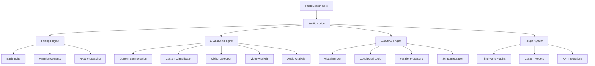

# PhotoSearch Studio Addon - Advanced Editing & AI Analysis Suite

## Vision Statement

PhotoSearch Studio transforms PhotoSearch from a powerful media management tool into a comprehensive creative suite that combines professional-grade editing with customizable AI-powered analysis and workflow automation. Inspired by Lightroom and Photoshop but designed for the modern, AI-augmented workflow.

## Core Value Proposition

**"The only photo management system where you can find, organize, edit, and analyze your media with custom AI workflows - all in one place."**

### Key Differentiators

1. **Unified Workflow**: Seamless transition from search → organization → editing → analysis
2. **Custom AI Models**: Train AI to recognize YOUR specific needs (products, styles, subjects)
3. **Workflow Automation**: Build custom processing pipelines without coding
4. **Multi-Media Support**: Photos, videos, audio, documents in one interface
5. **Extensible Architecture**: Plugin system for unlimited expansion

## Target Market

### Primary Users

1. **Professional Photographers**
   - Wedding, portrait, commercial photographers
   - Need: Fast culling, batch editing, client delivery
   - Pain Points: Switching between multiple tools

2. **Content Creators & Influencers**
   - Social media creators, bloggers, YouTubers
   - Need: Quick editing, consistent style, multi-platform export
   - Pain Points: Maintaining brand consistency

3. **E-commerce & Product Photography**
   - Online store owners, product photographers
   - Need: Batch processing, background removal, consistent lighting
   - Pain Points: Repetitive editing tasks

4. **Researchers & Archivists**
   - Academic researchers, museum archivists
   - Need: Metadata management, custom analysis, preservation
   - Pain Points: Lack of specialized tools

5. **AI/ML Practitioners**
   - Data scientists, ML engineers
   - Need: Custom dataset creation, annotation, analysis
   - Pain Points: Manual data preparation

## Technical Architecture

### High-Level Components



### Performance Strategy

1. **WebAssembly Core**
   - Performance-critical operations in WASM
   - Portable across platforms
   - Near-native performance

2. **GPU Acceleration**
   - WebGL/WebGPU for rendering
   - GPU-accelerated AI inference
   - Hardware-accelerated effects

3. **Distributed Processing**
   - Local processing for privacy
   - Cloud processing for heavy tasks
   - Hybrid approach based on user preference

4. **Progressive Enhancement**
   - Basic features work everywhere
   - Advanced features enable based on capabilities
   - Graceful degradation

## Feature Breakdown

### 1. Advanced Editing Suite

#### Basic Editing Tools
- **Non-Destructive Editing**: Adjustment layers, history preservation
- **Color Correction**: White balance, exposure, curves, levels
- **Cropping & Transform**: Perspective correction, straightening, resizing
- **Retouching**: Clone stamp, healing brush, blemish removal
- **Filters & Effects**: Vintage effects, artistic filters, textures

#### AI-Powered Editing
- **Auto-Enhancement**: One-click optimization based on content type
- **Style Transfer**: Apply artistic styles using neural networks
- **Object Removal**: Content-aware fill with AI inpainting
- **Super-Resolution**: Upscale images while preserving quality
- **Noise Reduction**: Advanced denoising for high-ISO images
- **Face Enhancement**: Portrait optimization, skin smoothing

#### Professional Tools
- **RAW Processing**: Full RAW file support with camera-specific profiles
- **HDR Merging**: Automatic exposure blending
- **Panorama Stitching**: Multi-image panorama creation
- **Focus Stacking**: Extended depth of field
- **Color Grading**: Professional color correction tools
- **Batch Processing**: Apply edits to multiple images

### 2. Custom AI Analysis

#### Custom Segmentation
- **Trainable Models**: Teach AI to recognize specific objects
- **Semantic Segmentation**: Pixel-level object masks
- **Instance Segmentation**: Individual object separation
- **Interactive Refinement**: Manual correction of AI results
- **Export Options**: Masks, alpha channels, JSON annotations

#### Custom Classification
- **Multi-Class Classification**: Assign images to categories
- **Multi-Label Classification**: Tag with multiple labels
- **Hierarchical Classification**: Nested category structures
- **Confidence Thresholds**: Adjust sensitivity
- **Batch Classification**: Process entire collections

#### Object Detection & Tracking
- **Custom Object Detection**: Train detectors for specific items
- **Real-time Tracking**: Video object tracking
- **Pose Estimation**: Human pose detection
- **Facial Analysis**: Emotion, age, gender detection
- **OCR Integration**: Text extraction and analysis

### 3. Multi-Media Analysis

#### Video Analysis
- **Scene Detection**: Automatic scene segmentation
- **Object Tracking**: Follow objects across frames
- **Motion Analysis**: Movement patterns and tracking
- **Video Summarization**: Automatic highlight creation
- **Frame Extraction**: Key frame identification

#### Audio Analysis
- **Speech Recognition**: Transcription and subtitles
- **Sound Classification**: Identify audio content
- **Music Analysis**: Beat detection, mood analysis
- **Audio Enhancement**: Noise reduction, equalization
- **Voice Isolation**: Separate speech from background

#### Document Analysis
- **OCR**: Text extraction from images
- **Layout Analysis**: Document structure understanding
- **Form Recognition**: Automated form processing
- **Table Extraction**: Convert tables to structured data
- **Handwriting Recognition**: Manual text extraction

### 4. Workflow Automation

#### Visual Workflow Builder
- **Drag-and-Drop Interface**: Intuitive pipeline creation
- **Conditional Logic**: If-then branching
- **Parallel Processing**: Multiple operations simultaneously
- **Error Handling**: Graceful failure recovery
- **Visual Debugging**: Step-by-step execution tracing

#### Pre-Built Workflows
- **Photo Culling**: Automatic best-shot selection
- **Batch Editing**: Apply consistent style
- **Export Pipelines**: Multi-format export
- **Backup Workflows**: Automated backup routines
- **Social Media**: Optimized posting workflows

#### Custom Script Integration
- **JavaScript/Python Support**: Custom script nodes
- **API Access**: Full access to PhotoSearch API
- **Variable System**: Dynamic parameter passing
- **Error Handling**: Try-catch mechanisms
- **Performance Monitoring**: Execution metrics

### 5. Professional Features

#### Collaboration Tools
- **Team Workspaces**: Shared collections and projects
- **Version Control**: Edit history and rollback
- **Review System**: Comments and annotations
- **Approval Workflows**: Multi-stage review processes
- **Activity Tracking**: Change history and auditing

#### Enterprise Features
- **Custom Branding**: White-label solutions
- **API Access**: Programmatic control
- **On-Premise Deployment**: Self-hosted options
- **SSO Integration**: Enterprise authentication
- **Advanced Security**: Role-based access control

#### Developer Features
- **Plugin SDK**: Create custom extensions
- **Model Integration**: Import custom AI models
- **Webhook Support**: Event-driven automation
- **Custom UI Components**: Extend the interface
- **Performance Profiling**: Optimization tools

## User Interface Design

### Professional Workspace

```markdown
┌─────────────────────────────────────────────────────┐
│  HEADER: Logo | Workspace Selector | User Menu       │
├─────────────────────────────────────────────────────┤
│  SIDEBAR:                                        │ MAIN AREA:     │
│  - Media Browser                                 │ - Editing Canvas│
│  - Tool Palette                                  │ - Preview Panel │
│  - Layer Panel                                   │ - Histogram     │
│  - History Panel                                 │ - Metadata      │
│  - AI Analysis Panel                             │ - Comments      │
└─────────────────────────────────────────────────────┘
│  STATUS BAR: Progress | Memory | GPU | Notifications  │
└─────────────────────────────────────────────────────┘
```

### Key UI Features

1. **Customizable Layouts**
   - Save workspace configurations
   - Role-based layout presets
   - Multi-monitor support
   - Touch/pen optimized

2. **Context-Aware Tools**
   - Smart tool selection
   - AI-powered suggestions
   - Adaptive toolbars
   - Quick access palettes

3. **Visual Feedback**
   - Real-time previews
   - Before/after comparisons
   - Histogram overlays
   - Performance indicators

4. **Accessibility**
   - Keyboard shortcuts
   - Screen reader support
   - High contrast modes
   - Customizable UI scaling

## Implementation Roadmap

### Phase 1: Foundation (3-6 months)
```markdown
- [ ] Core editing engine integration
- [ ] Basic AI analysis modules
- [ ] Simple workflow builder
- [ ] Plugin architecture foundation
- [ ] Performance optimization layer
```

### Phase 2: Advanced Features (6-12 months)
```markdown
- [ ] Custom AI model training
- [ ] Advanced workflow automation
- [ ] Multi-media analysis tools
- [ ] Collaboration features
- [ ] Enterprise security
```

### Phase 3: Professional Suite (12-18 months)
```markdown
- [ ] RAW processing pipeline
- [ ] Video editing integration
- [ ] Audio analysis suite
- [ ] Document processing
- [ ] 3D analysis tools
```

### Phase 4: Ecosystem Development (18-24 months)
```markdown
- [ ] Plugin marketplace
- [ ] Model marketplace
- [ ] Workflow marketplace
- [ ] Developer SDK
- [ ] Community tools
```

## Pricing Strategy

### Subscription Models

1. **Basic Studio**: $19.99/month
   - Basic editing tools
   - Standard AI analysis
   - Simple workflows
   - 5 custom models

2. **Pro Studio**: $39.99/month
   - Advanced editing
   - Custom AI training
   - Complex workflows
   - 20 custom models
   - Batch processing

3. **Enterprise Studio**: $99.99/month
   - All features
   - Unlimited custom models
   - Team collaboration
   - API access
   - Priority support

### Addon Pricing

1. **Editing Pack**: $9.99/month
   - Basic + AI editing tools
   - RAW processing
   - Batch operations

2. **AI Analysis Pack**: $14.99/month
   - Custom segmentation
   - Custom classification
   - Object detection
   - Video analysis

3. **Workflow Pack**: $9.99/month
   - Visual workflow builder
   - Pre-built workflows
   - Script integration

4. **Complete Studio**: $29.99/month
   - All features included
   - Best value option

### Usage-Based Pricing

```markdown
- $0.10 per AI analysis (pay-as-you-go)
- $0.25 per custom model training hour
- $0.50 per batch processing job
- Volume discounts available
```

## Technical Challenges & Solutions

### Challenge 1: Performance
**Problem**: Real-time AI processing in browser
**Solution**: WebAssembly + WebGPU + progressive enhancement

### Challenge 2: Model Training
**Problem**: Custom model training in browser
**Solution**: Hybrid approach (local + cloud) with transfer learning

### Challenge 3: Memory Management
**Problem**: Large image datasets consume memory
**Solution**: Virtualized processing, memory pooling, garbage collection

### Challenge 4: Cross-Platform
**Problem**: Consistent experience across devices
**Solution**: Responsive design, capability detection, progressive enhancement

### Challenge 5: Privacy & Security
**Problem**: Sensitive media processing
**Solution**: Dual local + cloud architecture, end-to-end encryption, user control

## Competitive Landscape

### vs. Adobe Lightroom/Photoshop
```markdown
✅ Integrated media management
✅ Custom AI model training
✅ Workflow automation
✅ More affordable pricing
✅ Web-based accessibility
❌ Less mature editing tools (initially)
```

### vs. Capture One
```markdown
✅ AI-powered workflows
✅ Custom analysis capabilities
✅ Multi-media support
✅ Better organization tools
❌ Less specialized for tethered shooting
```

### vs. Luminar AI
```markdown
✅ Integrated media management
✅ Customizable AI models
✅ Workflow automation
✅ Professional organization
❌ Less focus on presets
```

### vs. Darktable
```markdown
✅ Better UI/UX
✅ AI-powered features
✅ Workflow automation
✅ Multi-media support
❌ Less focus on RAW development (initially)
```

## Success Metrics

### User Adoption
- **Conversion Rate**: % of PhotoSearch users upgrading to Studio
- **Retention Rate**: % of Studio users remaining after 12 months
- **Feature Usage**: % of users utilizing advanced features
- **Session Duration**: Average time spent in Studio mode

### Business Metrics
- **Revenue Growth**: Monthly recurring revenue from Studio
- **ARPU Increase**: Average revenue per user
- **Churn Reduction**: Impact on overall churn rate
- **Upsell Success**: Conversion from free to paid tiers

### Technical Metrics
- **Performance**: Processing time for common operations
- **Reliability**: Uptime and error rates
- **Scalability**: Concurrent users supported
- **Resource Usage**: Memory and CPU efficiency

## Marketing Strategy

### Targeted Campaigns
```markdown
1. **Photographer Outreach**: Partner with photography communities
2. **Content Creator Programs**: Influencer collaborations
3. **E-commerce Integration**: Shopify/WooCommerce plugins
4. **Educational Discounts**: Student and teacher programs
5. **Enterprise Pilots**: Free trials for teams
```

### Content Marketing
```markdown
1. **Tutorial Series**: "Mastering PhotoSearch Studio"
2. **Case Studies**: Real-world use cases
3. **Before/After Galleries**: Showcasing capabilities
4. **Community Challenges**: User-generated content
5. **Webinars**: Advanced techniques and workflows
```

### Partnerships
```markdown
1. **Camera Manufacturers**: Bundle with hardware
2. **Cloud Providers**: Integration partnerships
3. **AI Research**: Academic collaborations
4. **Plugin Developers**: Ecosystem growth
5. **Educational Institutions**: Curriculum integration
```

## Risk Assessment

### Technical Risks
```markdown
- Performance limitations in browser
- AI model accuracy and reliability
- Cross-platform compatibility issues
- Memory management challenges
- Security vulnerabilities
```

### Market Risks
```markdown
- Competition from established players
- User resistance to new workflows
- Pricing sensitivity
- Adoption barriers
- Feature creep
```

### Mitigation Strategies
```markdown
- Progressive enhancement approach
- Comprehensive testing and QA
- User feedback loops
- Phased rollout strategy
- Performance monitoring
```

## Conclusion

PhotoSearch Studio represents a significant opportunity to expand from a powerful media management tool into a comprehensive creative suite. By combining professional-grade editing with customizable AI analysis and workflow automation, we can create a unique offering that addresses gaps in the current market.

### Key Benefits

1. **Differentiation**: Unique combination of search, organization, and AI-powered editing
2. **Monetization**: High-value addon with strong revenue potential
3. **User Retention**: Increased stickiness through comprehensive workflow
4. **Market Expansion**: Appeal to professional users with advanced needs
5. **Ecosystem Growth**: Plugin system enables community contributions

### Next Steps

1. **Prototype Development**: Build core editing and AI analysis modules
2. **User Testing**: Validate concepts with target users
3. **Performance Optimization**: Ensure smooth operation with large datasets
4. **Pricing Validation**: Test pricing models with early adopters
5. **Marketing Preparation**: Develop launch materials and campaigns

The Studio addon has the potential to transform PhotoSearch from a niche media management tool into a comprehensive creative platform, competing with established players while offering unique AI-powered capabilities that set it apart in the market.
